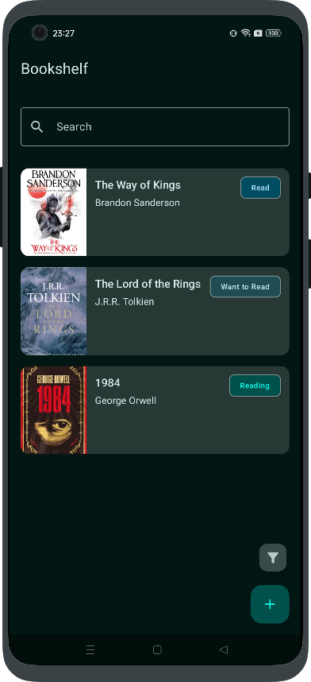

<br>
<p align="center">
  
</p>
<br>

[](https://github.com/Nirtas/booktracker/releases/latest)
[](https://www.gnu.org/licenses/agpl-3.0.ru.html)

[Русская версия](README.ru.md)

# BookTracker

A full-stack project built with Kotlin for tracking your reading list.

- **Android App:** Jetpack Compose, Hilt, Ktor Client, Room
- **Backend Server:** Ktor, Koin, Exposed, PostgreSQL

## Android App Screenshots

<table align="center">
  <tr>
    <td align="center" valign="top">
      
      <br>
      <sub><b>List Screen</b></sub>
    </td>
    <td align="center" valign="top">
      
      <br>
      <sub><b>Book Details Screen</b></sub>
    </td>
    <td align="center" valign="top">
      
      <br>
      <sub><b>Add/Edit Book Screen</b></sub>
    </td>
    <td align="center" valign="top">
      
      <br>
      <sub><b>Sorting & Filters</b></sub>
    </td>
  </tr>
</table>
<br>
<details>
  <summary>Click to see Light Theme</summary>
  <table align="center">
    <tr>
      <td align="center" valign="top">
        
        <br>
        <sub><b>List Screen</b></sub>
      </td>
      <td align="center" valign="top">
        
        <br>
        <sub><b>Book Details Screen</b></sub>
      </td>
      <td align="center" valign="top">
        
        <br>
        <sub><b>Add/Edit Book Screen</b></sub>
      </td>
      <td align="center" valign="top">
        
        <br>
        <sub><b>Sorting & Filters</b></sub>
      </td>
    </tr>
  </table>
</details>

## Structure

- `android/` - Android application source code.
- [`backend/`](backend/README.md) - Ktor server source code.
- `docker-compose.yml` - Configuration for running the server and database.
- `database-init/` - SQL scripts for initial database setup.
- `pgadmin-config/` - Configuration for the pgAdmin service.

## Development Environment

This project uses Docker Compose to run a full development environment. The `docker-compose.yml` file sets up:
1. **db:** A PostgreSQL database.
2. **pgadmin:** A pgAdmin instance for database management.
3. **backend-dev:** The Ktor server, built from source using `backend/Dockerfile`.
4. **backend-prod:** The Ktor server, built from jar file using `Dockerfile.prod`.
5. **file-storage:** A dedicated `nginx` container that serves static files (book covers).

- **Database Initialization**: The `database-init` folder contains `.sql` scripts that are automatically executed on the first run to create the schema and seed initial data.
- **pgAdmin Auto-config**: The `pgadmin-config` folder automatically registers and configures the connection to the `db` service, so you don't have to do it manually.

## Configuration

For local development, copy `.env.local.example` to `.env.local` and fill with your local settings.

### Docker Compose

Configuration is managed through `.env` file in the root directory. Copy `.env.example` to `.env` and fill with your production settings.

### Android App

Used to configure the Android application.
1. Copy `secrets.properties.example` to `secrets.properties`.
2. Fill with your settings.

### Android SDK

The root `local.properties` file is used by Gradle to locate the Android SDK. It should contain a line like this:

```properties
sdk.dir=C\:\\Users\\user\\Path\\To\\Android\\Sdk
```

## Launch

This project can be launched in two modes: **development** (building from source) and **production** (using a pre-built JAR).

### For Development (from source code)

This mode is for developers who want to work on the code. It requires the full source code.

**Prerequisites:**
1. Clone the entire repository: `git clone ...`
2. Ensure Docker and Docker Compose are installed.
3. Set up the configuration files as described in the **Configuration** section (`.env`, `secrets.properties`).

**Launch Command:**
Run the following command from the project root to build and start all services:

```bash
docker compose --profile dev up --build -d
```

### For Production Deployment (from pre-built JAR)

This mode is for deploying a specific version of the application. It does not require the full source code.

**Prerequisites:**
1. Get the JAR file: download it from the desired release on the project's GitHub Releases page.
2. Create a deployment directory and place the following files and folders inside it:
    * `database-init/`
    * `pgadmin-config/`
    * `.env`
    * The application JAR file
    * `docker-compose.yml`
    * `Dockerfile.prod`
3. Configure: fill `.env` file with your production settings.

**Launch Command:**
Run the following command from your deployment directory to build and start all services:

```bash
docker compose --profile prod up --build -d
```
