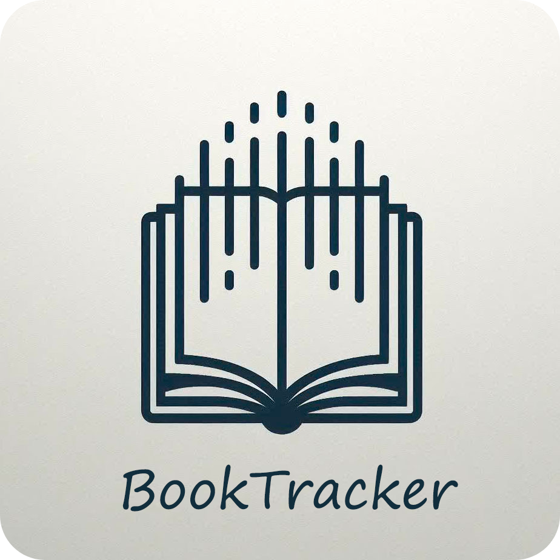

<br>
<p align="center">
  
</p>
<br>

[](https://github.com/Nirtas/booktracker/releases/latest)
[](https://www.gnu.org/licenses/agpl-3.0.ru.html)

[English version](README.md)

# BookTracker

Full-stack проект на Kotlin для учета прочитанных книг.

- **Android App:** Jetpack Compose, Hilt, Ktor Client, Room
- **Backend Server:** Ktor, Koin, Exposed, PostgreSQL

## Скриншоты Android-приложения

<table align="center">
  <tr>
    <td align="center" valign="top">
      
      <br>
      <sub><b>Список книг</b></sub>
    </td>
    <td align="center" valign="top">
      
      <br>
      <sub><b>Информация о книге</b></sub>
    </td>
    <td align="center" valign="top">
      
      <br>
      <sub><b>Добавление/Редактирование книги</b></sub>
    </td>
    <td align="center" valign="top">
      
      <br>
      <sub><b>Сортировка и фильтры</b></sub>
    </td>
  </tr>
</table>
<br>
<details>
  <summary>Нажмите, чтобы увидеть Светлую тему</summary>
  <table align="center">
    <tr>
      <td align="center" valign="top">
        
        <br>
        <sub><b>Список книг</b></sub>
      </td>
      <td align="center" valign="top">
        
        <br>
        <sub><b>Информация о книге</b></sub>
      </td>
      <td align="center" valign="top">
        
        <br>
        <sub><b>Добавление/Редактирование книги</b></sub>
      </td>
      <td align="center" valign="top">
        
        <br>
        <sub><b>Сортировка и фильтры</b></sub>
      </td>
    </tr>
  </table>
</details>

## Структура

- `android/` - Исходный код Android-приложения.
- [`backend/`](backend/README.ru.md) - Исходный код Ktor-сервера.
- `docker-compose.yml` - Конфигурация для запуска сервера и базы данных.
- `database-init/` - SQL-скрипты для инициализации базы данных.
- `pgadmin-config/` - Конфигурация для сервиса pgAdmin.

## Окружение для разработки

Проект использует Docker Compose для запуска полного окружения. Файл `docker-compose.yml` содержит определения для следующих сервисов:
1. **db:** База данных PostgreSQL.
2. **pgadmin:** pgAdmin для управления базой данных.
3. **backend-dev:** Ktor-сервер, собираемый из исходного кода с помощью `backend/Dockerfile`.
4. **backend-prod:** Ktor-сервер, собираемый из jar-файла с помощью `Dockerfile.prod`.
5. **file-storage:** Отдельный контейнер `nginx`, который отвечает за раздачу статичных файлов (обложек книг).

- **Инициализация БД**: Папка `database-init` содержит `.sql` скрипты, которые автоматически выполняются при первом запуске для создания схемы и начальных данных.
- **Авто-конфигурация pgAdmin**: Папка `pgadmin-config` автоматически регистрирует и настраивает подключение к сервису `db`, так что вам не нужно делать это вручную.

## Настройка

Для локальной разработки скопируйте `.env.local.example` в `.env.local` и заполните его своими настройками.

### Docker Compose

Конфигурация управляется через файл `.env` в корневой директории. Скопируйте `.env.example` в `.env` и заполните его вашими production-настройками.

### Android-приложение

Используется для настройки Android-приложения.
1. Скопируйте `secrets.properties.example` в `secrets.properties`.
2. Заполните его своими настройками.

### Android SDK

Корневой файл `local.properties` используется Gradle для поиска Android SDK. Он должен содержать путь, например:

```properties
sdk.dir=C\:\\Users\\user\\Path\\To\\Android\\Sdk
```

## Запуск

Проект можно запустить в двух режимах: **для разработки** (сборка из исходников) и **production** (использование готового JAR-файла).

### Для разработки (из исходного кода)

Этот режим предназначен для разработчиков, которые будут работать над кодом. Требуется полный исходный код.

**Требования:**
1. Склонируйте репозиторий целиком: `git clone ...`
2. Убедитесь, что Docker и Docker Compose установлены.
3. Настройте конфигурационные файлы, как описано в разделе **Конфигурация** (`.env`, `secrets.properties`).

**Команда для запуска:**
Выполните следующую команду из корня проекта, чтобы собрать и запустить все сервисы:

```bash
docker compose --profile dev up --build -d
```

### Для Production-развертывания (из готового JAR-файла)

Этот режим предназначен для развертывания конкретной версии приложения. Он не требует наличия исходного кода.

**Требования:**
1. Получите JAR-файл: скачайте его из нужного релиза на странице GitHub Releases проекта.
2. Создайте директорию для развертывания и поместите в нее следующие файлы и папки:
    * `database-init/`
    * `pgadmin-config/`
    * `.env`
    * JAR-файл приложения
    * `docker-compose.yml`
    * `Dockerfile.prod`
3. Настройка: заполните файл `.env` вашими production-настройками.

**Команда для запуска:** 
Выполните следующую команду из директории развертывания, чтобы собрать и запустить все сервисы:

```bash
docker compose --profile prod up --build -d
```
